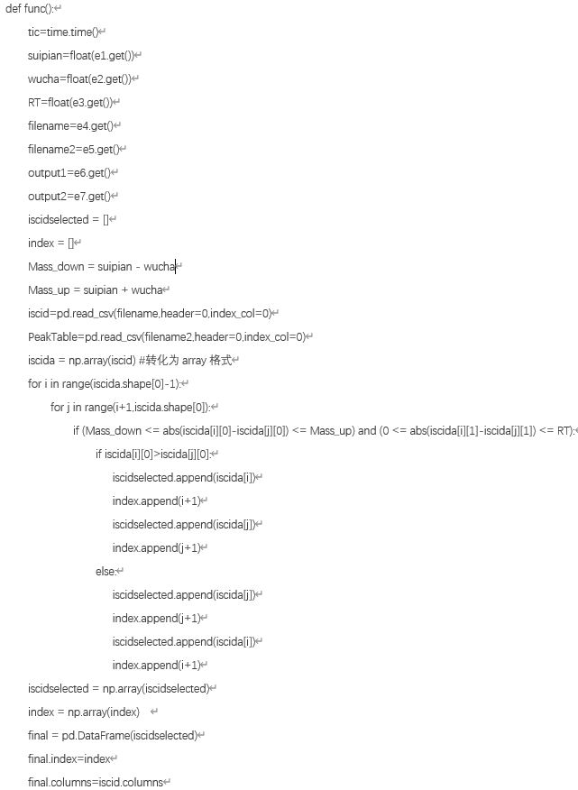
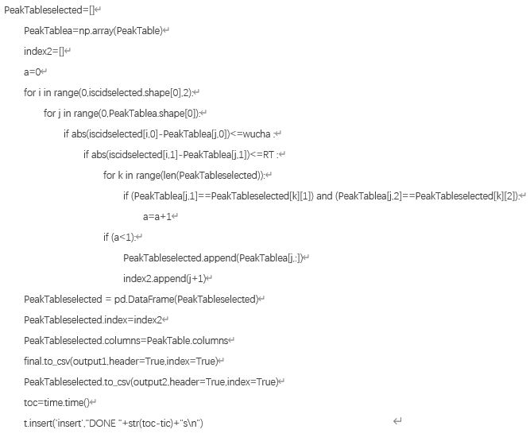
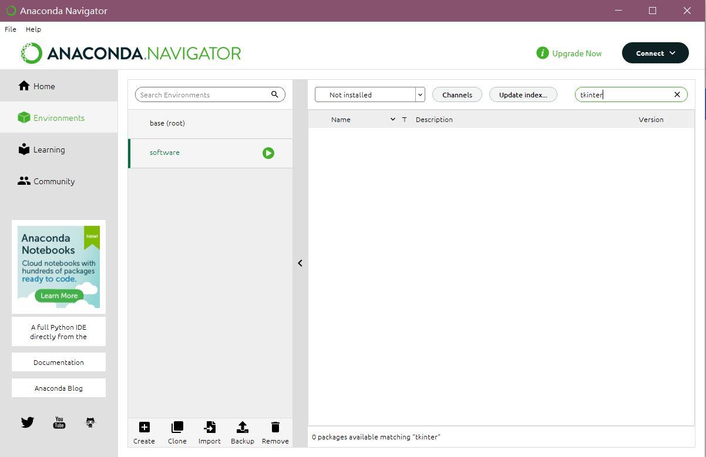

```{r setup, include=FALSE}
knitr::opts_chunk$set(echo = FALSE)
```
# STEP1 Codeing your software with tkinter 

**Make sure to install the module tkinter**

 import tkinter as tk
 
 import numpy as np
 
 import pandas as pd
 
 import time
 
 *Firstly make the window*
 
 window=tk.Tk()
 
 *Name my software*
 
 window.title('mass spectrometry data processing')
 
 *The size of your software*
 
 window.geometry('1500x900')
 
 *Label my software*
 
 l1=tk.Label(window,text='a mass spectrometry data processing software made by Yifan Yue',font=("Times",8,"bold"))#font=Times，size=8，letters to be bold
 
 l1.place(relx=0.5,rely=0.93,relheight=0.1,relwidth=0.5)
 
 *Make the input frame*
 
 e1=tk.Entry(window)
 
 e1.place(relx=0.25,rely=0.05,relheight=0.08,relwidth=0.5)
 
 e1.insert(0, "Molecular weight of missing fragments;ex:162.05282")
 
 e2=tk.Entry(window)
 
 e2.place(relx=0.25,rely=0.15,relheight=0.08,relwidth=0.5)
 
 e2.insert(0, "Allowable error of molecular weight;ex:0.002")
 
 e3=tk.Entry(window)
 
 e3.place(relx=0.25,rely=0.25,relheight=0.08,relwidth=0.5)
 
 e3.insert(0, "Allowable error of retention time;ex:0.1")
 
 e4=tk.Entry(window)
 
 e4.place(relx=0.25,rely=0.35,relheight=0.08,relwidth=0.5)
 
 e4.insert(0, "Address and Name of the first input CSV table")
 
 e5=tk.Entry(window)
 
 e5.place(relx=0.25,rely=0.45,relheight=0.08,relwidth=0.5)
 
 e5.insert(0, "Address and Name of the second input CSV table")
 
 e6=tk.Entry(window)
 
 e6.place(relx=0.25,rely=0.55,relheight=0.08,relwidth=0.5)
 
 e6.insert(0, "Address and Name of the first input CSV table")
 
 e7=tk.Entry(window)
 
 e7.place(relx=0.25,rely=0.65,relheight=0.08,relwidth=0.5)
 
 e7.insert(0, "Address and Name of the second output CSV table")
 
 *make the text frame*
 
 t=tk.Text(window,height=2)
 
 t.place(relx=0.25,rely=0.75,relheight=0.08,relwidth=0.5)
 
 *My function to be run*
 
 <div style="text-align: center">
 
 
 
 
  
 </div>
 
  *Make the button*
  
  b1=tk.Button(window,text='search',command=func)
  
  b1.place(relx=0.25,rely=0.85,relheight=0.08,relwidth=0.5)
  
  *Finally make your whole window work*
  
  window.mainloop()
  
# STEP2 Build a virtual environment in Anaconda Navigator


 <div style="text-align: center">
 
 
 
 </div>
 
# STEP3 Install all the modules using in the software to the virtual environment

# STEP4 Use pyinstaller to pack your software. 

# DONE!😆

    


